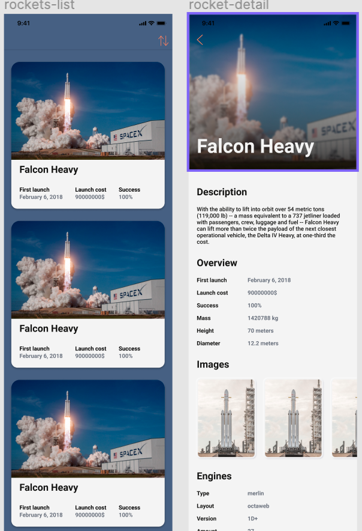

# Task11-PDP
My implementation of XSpace API client
## Design Requirements: https://www.figma.com/file/XBWkCkppfG8liSBVsnd9Kq/Task-11?node-id=0%3A1
### While work in progress app can't be builded. Used architechture - VIPER

